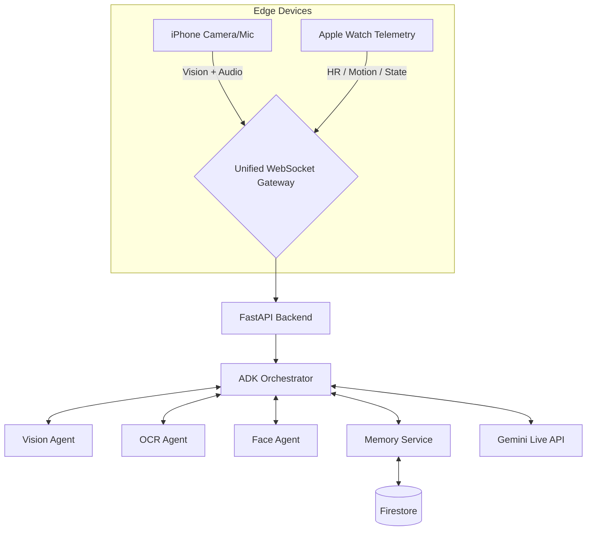

<div align="center">
  
  <h1>SightLine</h1>
  <h3>Context-Aware Live Agent for Blind & Low-Vision Users</h3>
  <p><em>Delivering the right information density at the right moment for real-world accessibility.</em></p>
</div>

---

## Languages

- English (default): this file
- 中文版本: [README.zh-CN.md](README.zh-CN.md)

## ✨ Project Overview (Current)

**SightLine** is a real-time semantic assistance system for blind and low-vision users:

- **Edge (iOS + watchOS):** Captures video, audio, motion state, step cadence, ambient noise, and heart rate.
- **Cloud (FastAPI + Google ADK):** Processes multimodal streams via a unified WebSocket and orchestrates specialized agents.
- **Core capability (Adaptive LOD):** Dynamically adjusts response density so the assistant is useful without being overwhelming.

> Current code status (2026-02-23): Swift Native client + FastAPI realtime backend + Cloud Run deployment pipeline + Firestore memory system + InsightFace face recognition pipeline are integrated.

## 🎯 Core Value

1. **Adaptive LOD (3 levels)**
  - **LOD 1:** 15–40 words, safety-first, triggered by movement/high noise/panic heart rate.
  - **LOD 2:** 80–150 words, standard navigation and spatial context.
  - **LOD 3:** 400–800 words, richer narrative and OCR-heavy guidance when stationary.
2. **Context Awareness (3 layers)**
  - Ephemeral (ms~sec) / Session (min~hours) / Long-term (cross-session).
3. **Hardware-Agnostic Architecture**
  - SEP abstractions across vision/audio/telemetry channels; iPhone + Apple Watch are the current primary edge devices.

## 🏗️ Architecture Snapshot



  ## 🤖 Agent Orchestration (Current)

  - **Orchestrator Agent:** Unified decision layer and response entry point.
  - **Vision Agent:** Scene understanding with LOD-adaptive summarization.
  - **OCR Agent:** Text extraction for menus, signs, and documents.
  - **Face Agent:** InsightFace `buffalo_l` 512-D embeddings + cosine matching (default threshold `0.4`).
  - **Memory Service:** Long-term preferences and session memory persisted in Firestore (vector retrieval).
  - **Tool Calling:** Google Maps (navigation/places) + Grounding (retrieval augmentation).

  ## 📁 Repository Structure (Key)

```text
ContextGen/
├── README.md
  ├── README.zh-CN.md
  ├── docs/                                # specs, research, architecture docs
└── SightLine/
    ├── server.py                        # FastAPI + WebSocket realtime backend entry
    ├── agents/                          # orchestrator / vision / ocr / face
    ├── live_api/                        # session management and live streaming bridge
    ├── lod/                             # LOD engine, panic handling, telemetry aggregation
    ├── memory/                          # long-term memory system
    ├── telemetry/                       # sensor payload parsing
    ├── scripts/run_watch_device_tests.sh
    ├── cloudbuild.yaml                  # Cloud Build -> Cloud Run deployment
    ├── Dockerfile
    ├── requirements.txt
    └── SightLine.xcodeproj/             # iOS + watchOS project
```

  ## 🚀 Quick Start (Backend)

  ### 1) Environment Setup

```bash
cd SightLine
python3.12 -m venv .venv
source .venv/bin/activate
pip install -r requirements.txt
cp .env.example .env
```

Fill the minimum required values in `.env`:

- `GOOGLE_CLOUD_PROJECT`
- `GOOGLE_API_KEY`
- `GOOGLE_MAPS_API_KEY`
- `GOOGLE_GENAI_USE_VERTEXAI` (typically `TRUE` for local, `FALSE` on Cloud Run)

### 2) Run the Service

```bash
cd SightLine
python -m uvicorn server:app --host 0.0.0.0 --port 8080
```

Health check:

```bash
curl http://localhost:8080/health
```

## 🍎 iOS / Watch Testing

Physical Apple Watch test script (includes lock-state preflight + one retry):

```bash
cd SightLine
./scripts/run_watch_device_tests.sh
```

Optional overrides:

```bash
SIGHTLINE_WATCH_DESTINATION_ID=<watch-device-id> \
SIGHTLINE_WATCH_ARCH=arm64 \
./scripts/run_watch_device_tests.sh
```

## ☁️ Deployment (Cloud Run)

The repo includes `cloudbuild.yaml` with the following defaults:

- `--min-instances=1` (reduce cold starts)
- `--cpu-boost` + `--no-cpu-throttling`
- `--memory=2Gi` / `--cpu=2`
- Secret Manager injection for Gemini / Maps keys

Build trigger example:

```bash
cd SightLine
gcloud builds submit --config cloudbuild.yaml
```

## 📚 Key Documentation

- Product and technical final spec: `docs/SightLine_Final_Specification.md`
- Consolidated development reference: `docs/SightLine_Consolidated_Development_Reference.md`
- Agent orchestration and context modeling: `docs/SightLine 核心架构_ Agent编排与上下文建模.md`
- iOS/backend protocol alignment: `docs/SightLine_iOS_Backend_Protocol_Alignment_Matrix.md`

## 🧭 Short-Term Roadmap

- Complete end-to-end stability stress tests (long sessions + high-frequency telemetry + voice interruption).
- Further tune LOD transition thresholds to reduce false triggers and repetitive narration.
- Polish Face Library and Memory Forgetting into a clear product loop.
- Expand automated test coverage for key modules.

---

<div align="center">
  <p><em>Built for accessibility-first real-world assistance.</em></p>
</div>

