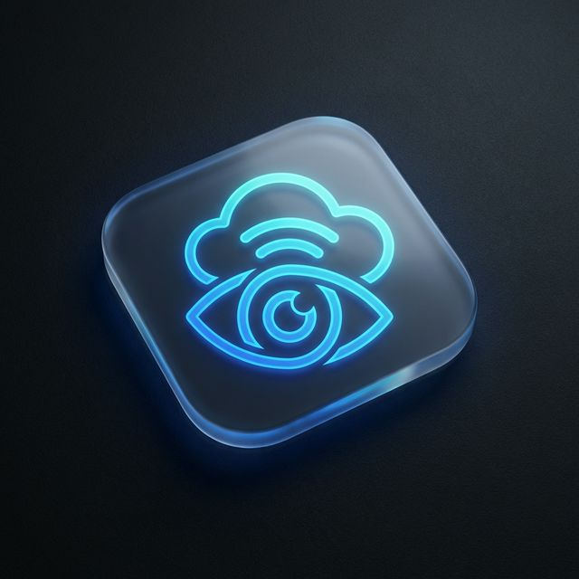

<div align="center">
  
  <h1>SightLine</h1>
  <h3>A Hardware-Agnostic Cloud OS for Accessibility</h3>
  <p>
    <em>Empowering visually impaired users with real-time, context-aware auditory guidance.</em>
  </p>
</div>

---

## 👁️ Vision

When building for accessibility, creating another siloed smartphone App is the wrong approach. Visually impaired users don't want to hold a phone out in front of them; they want to use their smartwatches, their hearing aids, and emerging smart glasses. 

That's why we built **SightLine**—not just an App, but a **hardware-agnostic Cloud Operating System for accessibility**. 

By decoupling the architecture into three unified channels (Vision, Audio, and Telemetry), any hardware manufacturer can connect to our central API gateway using the **SightLine Edge Protocol (SEP)**. If a Sony earbud streams audio and an Apple Watch streams heart-rate telemetry, our ADK Orchestrator fuses them in the cloud. We interpret the world so our users can experience it seamlessly.

## 🏗️ System Architecture

SightLine operates on a robust **Server-to-Server** architecture, entirely decoupling the client (sensors and outputs) from the cloud processing brain. 

Our current implementation uses a **Swift Native iOS App** paired with a **watchOS App** as the sensory edge devices:
- **iPhone** acts as the primary sensor hub (Video, Audio, CoreMotion, GPS).
- **Apple Watch** transmits real-time telemetry (Heart Rate via `HKWorkoutSession` / `WCSession`).
- **Cloud Run Backend** processes the sensory inputs using Google's generative AI models.

Communication is handled via a single, highly-optimized **WebSocket (`NWConnection`)**, unified to carry audio, video frames, and telemetry JSON payloads.

```mermaid
graph TD
    subgraph Edge Devices (Hardware Agnostic)
        A[Smart Glasses / iPhone Camera] -->|SEP-Vision: JPEG Streams| D{SightLine API Gateway}
        B[Hearing Aids / AirPods] <-->|SEP-Audio: PCM 16kHz| D
        C[Apple Watch / Sensors] -->|SEP-Telemetry: JSON| D
    end
    
    D -->|Unified WebSocket| E[Cloud Run ADK Backend]
    
    subgraph SightLine Cloud Brain
        E --> F(Context Parser)
        F --> G(ADK Orchestrator Agent)
        G <--> H[Adaptive LOD Engine]
        G <--> I[Gemini 2.5 Flash Live API]
        G <--> J[Specialized Sub-Agents]
    end
    
    I -->|Adaptive TTS Audio| E
    E -->|Route to Edge| B
```

## 🧠 The Adaptive LOD Engine

The core innovation of SightLine is the **Level of Detail (LOD) Engine**. It decides *how much* to say and *when* to say it, adopting the UX philosophy of "tactfully keeping quiet." It dynamically builds the System Prompt fusing Ephemeral Context (sensors), Session Context (routing), and Long-Term Memory.

* **LOD 1 (Safety & Alert - 15~40 words)**: Triggered during fast movement, high ambient noise (>80dB), or a heart-rate spike (>120 BPM - **PANIC mode**). Focuses entirely on immediate safety threats.
* **LOD 2 (Standard Navigation - 80~150 words)**: Triggered during slow exploration or entering new spaces. Describes layout and key obstacles.
* **LOD 3 (Narrative & Rich Description - 400~800 words)**: Triggered when stationary or upon explicit user request. Delivers rich, atmospheric descriptions and reads text.

### Stability Hardening
To guarantee a safe and seamless experience, the engine employs:
1. **LOD-Aware Telemetry Throttling**: Reduces data overhead based on the current LOD.
2. **PANIC Interrupt**: Instantly flushes the TTS queue and switches to LOD 1 upon detecting stress metrics.
3. **Local Fallback**: Drops to a local LOD 1 state ("Safe Mode") with haptic feedback if the WebSocket unexpectedly disconnects.
4. **DebugOverlay**: Exposes advanced real-time metrics (LOD status, triggers, HR Sparkline, Memory top-3, WS Latency) for rigorous engineering testing.

## 🤖 Multi-Agent Orchestration

SightLine uses **Google ADK (Agent Development Kit)** to orchestrate multiple specialized agents. The **Orchestrator Agent**, powered by the `gemini-2.5-flash-native-audio` Live API, is the sole voice the user hears, coordinating tasks silently among sub-agents:

* **Vision Sub-Agent** (`gemini-3.1-pro-preview`): Performs proactive visual extraction. It doesn't just answer "What do you see?"—it determines "How does this impact the visually impaired user's action?" dynamically scaling down token usage on LOD 1 to save costs.
* **OCR Sub-Agent** (`gemini-3-flash-preview`): Reads menus, signs, and documents when looking at text-heavy scenes.
* **Face ID Sub-Agent**: A local ONNX-based `InsightFace buffalo_l` module generating 512-D embeddings. It matches detected faces against the user’s personal `face_library` via cosine similarity >0.4 to discreetly whisper names of approaching friends.
* **Memory Sub-Agent** (`MemoryBankService`): Extracts implicit preferences and habits, manages the memory write budget (Top 5 per session), and handles forgetting requests.

### Tool Call Integration (Function Calling)
* **Google Maps Navigation**: Real-time routing (`navigate_to`, `nearby_search`) using Places and Routes APIs.
* **Grounding (Google Search)**: Eliminates hallucinations by pulling real-time information from Google Search. 

## 💾 Memory Deepening

SightLine manages a robust 3-layer memory architecture:
1. **Ephemeral**: ms-to-sec sensor snapshots (e.g., "HR 115", "Walking").
2. **Session**: Short-term state tracking spatial transitions and immediate goals using `VertexAiSessionService`.
3. **Long-Term Firestore Memory Bank**: We built a custom Memory Bank utilizing Firestore's native vector search. It stores 2048-D embeddings from `gemini-embedding-001`. Memories are weighted by a combination of semantic relevance, importance, and recency (exponential 24-hour decay). 

## 🚀 Cloud Deployment & Infrastructure

Designed for low latency and zero maintenance:
- **Google Cloud Run**: Min_instances set to 1 with CPU Boost enabled to eliminate cold starts.
- **Firestore (Native Mode)**: Serves as the backbone database handling User Profiles, Face ID libraries, and the robust Long-Term Memory.
- **Secret Manager**: Securely injects Gemini and Maps API keys.

### ⚙️ Terraform Bonus
The entire infrastructure is modeled as code using **Terraform**. This automates the provisioning of:
- Google Cloud Run services
- Firestore Composite Vector Indexes
- IAM Identity Access & Service Accounts
- Secret Manager injections

Run the automated deploy script:
```bash
cd infrastructure 
./deploy.sh
```

## 🧪 Watch Device Test Command

Use the dedicated script for physical Apple Watch testing. It performs a lock-state preflight, forces a stable `arm64` destination, and retries once if watchOS blocks navigation away from the clock UI state.

```bash
cd SightLine
./scripts/run_watch_device_tests.sh
```

Optional overrides:
```bash
SIGHTLINE_WATCH_DESTINATION_ID=00008310-0018C3A80A7B601E \
SIGHTLINE_WATCH_ARCH=arm64 \
./scripts/run_watch_device_tests.sh
```

---

<div align="center">
  <p><em>Built with ❤️ for a more accessible world.</em></p>
</div>
