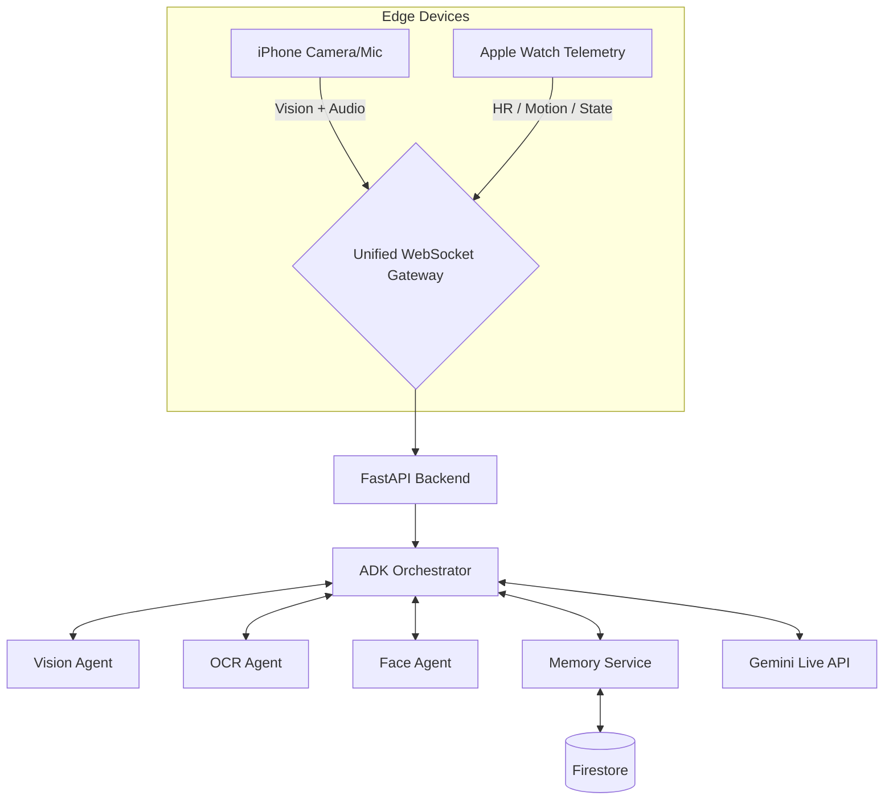

<div align="center">
  
  <h1>SightLine</h1>
  <h3>Context-Aware Live Agent for Blind & Low-Vision Users</h3>
  <p><em>在正确的时机，用正确的信息密度，给出真正有用的语音引导。</em></p>
</div>

---

## ✨ 项目概览（最新）

**SightLine** 是一个面向视障用户的实时语义辅助系统：

- **端侧（iOS + watchOS）**：采集视频、音频、运动状态、步频、噪声与心率。
- **云端（FastAPI + Google ADK）**：通过单 WebSocket 处理多模态流，并驱动多 Agent 协作。
- **核心能力（Adaptive LOD）**：根据用户状态动态调整语音密度，做到“知趣地闭嘴”。

> 当前代码状态（2026-02-23）：Swift Native 客户端 + FastAPI 实时后端 + Cloud Run 部署链路 + Firestore 记忆系统 + InsightFace 人脸识别管线已集成。

## 🎯 核心价值

1. **Adaptive LOD（三级细节）**
   - **LOD 1**：15–40 词，安全优先，移动/高噪声/恐慌心率触发。
   - **LOD 2**：80–150 词，标准导航与空间理解。
   - **LOD 3**：400–800 词，驻足时的细节叙述与 OCR 阅读。
2. **Context Awareness（三层上下文）**
   - Ephemeral（毫秒~秒）/ Session（分钟~小时）/ Long-term（跨会话）。
3. **Hardware-Agnostic 架构**
   - 通过 SEP 抽象视觉/音频/遥测三通道，当前以 iPhone + Apple Watch 为主入口。

## 🏗️ 架构速览



## 🤖 Agent 编排（当前实现）

- **Orchestrator Agent**：统一决策与响应出口。
- **Vision Agent**：场景理解 + LOD 自适应视觉摘要。
- **OCR Agent**：菜单、标识、文档文本抽取。
- **Face Agent**：InsightFace `buffalo_l` 512-D embedding + 余弦匹配（默认阈值 `0.4`）。
- **Memory Service**：长期偏好与会话记忆写入 Firestore（向量检索）。
- **工具调用**：Google Maps（导航/地点）+ Grounding（检索增强）。

## 📁 仓库结构（重点）

```text
ContextGen/
├── README.md
├── docs/                                # 规范、研究、架构文档
└── SightLine/
    ├── server.py                        # FastAPI + WebSocket 实时后端入口
    ├── agents/                          # orchestrator / vision / ocr / face
    ├── live_api/                        # 会话管理与流式桥接
    ├── lod/                             # LOD 引擎、panic、telemetry 聚合
    ├── memory/                          # 长期记忆系统
    ├── telemetry/                       # 传感器数据解析
    ├── scripts/run_watch_device_tests.sh
    ├── cloudbuild.yaml                  # Cloud Build -> Cloud Run
    ├── Dockerfile
    ├── requirements.txt
    └── SightLine.xcodeproj/             # iOS + watchOS 工程
```

## 🚀 本地快速启动（Backend）

### 1) 环境准备

```bash
cd SightLine
python3.12 -m venv .venv
source .venv/bin/activate
pip install -r requirements.txt
cp .env.example .env
```

按 `.env` 填写最少配置：

- `GOOGLE_CLOUD_PROJECT`
- `GOOGLE_API_KEY`
- `GOOGLE_MAPS_API_KEY`
- `GOOGLE_GENAI_USE_VERTEXAI`（本地通常为 `TRUE`，Cloud Run 为 `FALSE`）

### 2) 启动服务

```bash
cd SightLine
python -m uvicorn server:app --host 0.0.0.0 --port 8080
```

健康检查：

```bash
curl http://localhost:8080/health
```

## 🍎 iOS / Watch 测试

物理 Apple Watch 测试脚本（包含锁屏预检与一次自动重试）：

```bash
cd SightLine
./scripts/run_watch_device_tests.sh
```

可选参数：

```bash
SIGHTLINE_WATCH_DESTINATION_ID=<watch-device-id> \
SIGHTLINE_WATCH_ARCH=arm64 \
./scripts/run_watch_device_tests.sh
```

## ☁️ 部署（Cloud Run）

项目已提供 `cloudbuild.yaml`，默认部署配置包括：

- `--min-instances=1`（降低冷启动）
- `--cpu-boost` + `--no-cpu-throttling`
- `--memory=2Gi` / `--cpu=2`
- Secret Manager 注入 Gemini / Maps Key

触发构建示例：

```bash
cd SightLine
gcloud builds submit --config cloudbuild.yaml
```

## 📚 关键文档入口

- 产品与技术定稿：`docs/SightLine_Final_Specification.md`
- 开发参考汇总：`docs/SightLine_Consolidated_Development_Reference.md`
- Agent 编排与上下文建模：`docs/SightLine 核心架构_ Agent编排与上下文建模.md`
- iOS 与后端协议对齐：`docs/SightLine_iOS_Backend_Protocol_Alignment_Matrix.md`

## 🧭 Roadmap（短期）

- 完成端到端稳定性压测（长连接 + 高频遥测 + 语音打断场景）
- 继续收敛 LOD 切换阈值，减少误触发与重复播报
- 打磨 Face Library 与 Memory Forgetting 的产品闭环
- 补齐关键模块自动化测试覆盖

---

<div align="center">
  <p><em>Built for accessibility-first real-world assistance.</em></p>
</div>
